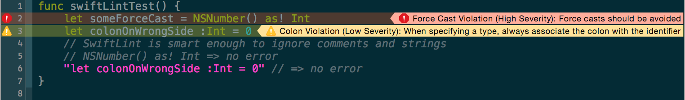

# SwiftLint

A tool to enforce Swift style and conventions, loosely based on
[GitHub's Swift Style Guide](https://github.com/github/swift-style-guide).

SwiftLint hooks into [Clang](http://clang.llvm.org) and
[SourceKit](http://www.jpsim.com/uncovering-sourcekit) to use the
[AST](http://clang.llvm.org/docs/IntroductionToTheClangAST.html) representation
of your source files for more accurate results.




## Installation

Using [Homebrew](http://brew.sh/)

```
brew install swiftlint
```

You can also install SwiftLint by downloading `SwiftLint.pkg` from the
[latest GitHub release](https://github.com/realm/SwiftLint/releases/latest) and
running it.

You can also build from source by cloning this project and running
`git submodule update --init --recursive; make install` (Xcode 7.1).

## Usage

### Xcode

Integrate SwiftLint into an Xcode scheme to get warnings and errors displayed
in the IDE. Just add a new "Run Script Phase" with:

```bash
if which swiftlint >/dev/null; then
  swiftlint
else
  echo "SwiftLint does not exist, download from https://github.com/realm/SwiftLint"
fi
```


### Atom

To integrate SwiftLint with [Atom](https://atom.io/) install the
[`linter-swiftlint`](https://atom.io/packages/linter-swiftlint) package from
APM.

### Command Line

```
$ swiftlint help
Available commands:

   help      Display general or command-specific help
   lint      Print lint warnings and errors for the Swift files in the current directory (default command)
   rules     Display the list of rules and their identifiers
   version   Display the current version of SwiftLint
```

Run `swiftlint` in the directory containing the Swift files to lint. Directories
will be searched recursively.

## Rules

There are only a small number of rules currently implemented, but we hope the
Swift community (that's you!) will contribute more over time. Pull requests are
encouraged.

The rules that *are* currently implemented are mostly there as a starting point
and are subject to change.

See the [Source/SwiftLintFramework/Rules](Source/SwiftLintFramework/Rules)
directory to see the currently implemented rules.

### Disable a rule in code

Rules can be disabled with a comment inside a source file with the following
format:

`// swiftlint:disable <rule>`

The rule will be disabled until the end of the file or until the linter sees a
matching enable comment:

`// swiftlint:enable <rule>`

For example:

```swift
// swiftlint:disable colon
let noWarning :String = "" // No warning about colons immediately after variable names!
// swiftlint:enable colon
let hasWarning :String = "" // Warning generated about colons immediately after variable names
```

It's also possible to modify a disable or enable command by appending
`:previous`, `:this` or `:next` for only applying the command to the previous,
this (current) or next line respectively.

For example:

```swift
// swiftlint:disable:next force_cast
let noWarning = NSNumber() as! Int
let hasWarning = NSNumber() as! Int
let noWarning2 = NSNumber() as! Int // swiftlint:disable:this force_cast
let noWarning3 = NSNumber() as! Int
// swiftlint:disable:previous force_cast
```

Run `swiftlint rules` to print a list of all available rules and their
identifiers.

### Configuration

Configure SwiftLint by adding a `.swiftlint.yml` file from the directory you'll
run SwiftLint from. The following parameters can be configured:

```yaml
disabled_rules: # rule identifiers to exclude from running
  - colon
  - comma
  - control_statement
  - force_cast
  - ...
  # Find all the available rules by running:
  # swiftlint rules
included: # paths to include during linting. `--path` is ignored if present.
  - Source
excluded: # paths to ignore during linting. Takes precedence over `included`.
  - Carthage
  - Pods
  - Source/ExcludedFolder
  - Source/EcludedFile.swift
# parameterized rules can be customized from this configuration file
line_length: 110
# parameterized rules are first parameterized as a warning level, then error level.
type_body_length:
  - 300 # warning
  - 400 # error
reporter: "csv" # reporter type (xcode, json, csv, checkstyle)
```

#### Nested Configurations

SwiftLint supports nesting configuration files for more granular control over
the linting process.

  * Set the `use_nested_configs: true` value in your root `.swiftlint.yml` file
  * Include additional `.swiftlint.yml` files where necessary in your directory
    structure.
  * Each file will be linted using the configuration file that is in it's
    directory or at the deepest level of it's parent directories. Otherwise the
    root configuration will be used.
  * `excluded`, `included`, and `use_nested_configs` are ignored for nested
    configurations

### Auto-correct

SwiftLint can automatically correct certain violations. Files on disk are
overwritten with a corrected version.

Please make sure to have backups of these files before running
`swiftlint autocorrect`, otherwise important data may be lost.

Standard linting is disabled while correcting because of the high likelihood of
violations (or their offsets) being incorrect after modifying a file while
applying corrections.

## License

MIT licensed.
