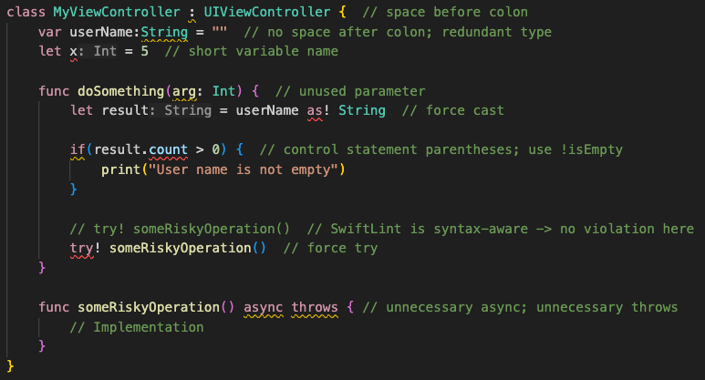
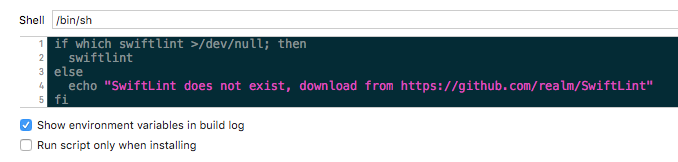
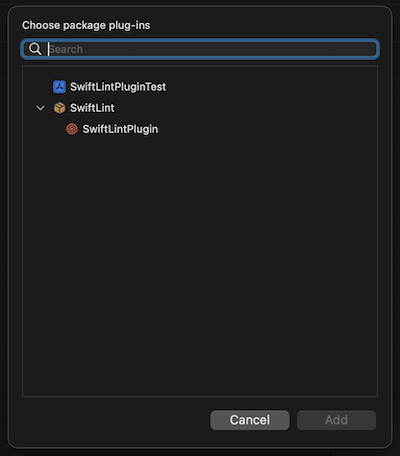
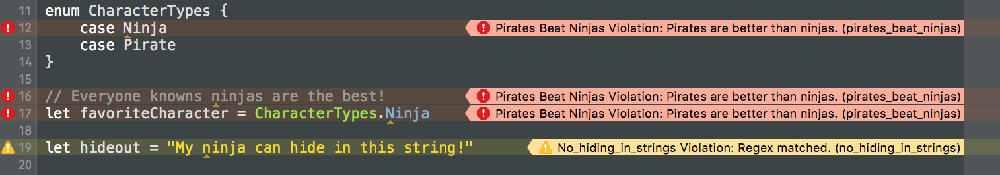

# SwiftLint

A tool to enforce Swift style and conventions, loosely based on the now archived [GitHub Swift Style Guide](https://github.com/github/swift-style-guide). SwiftLint enforces the style guide rules that are generally accepted by the Swift community. These rules are well described in popular style guides like [Ray Wenderlich's Swift Style Guide](https://github.com/raywenderlich/swift-style-guide).

SwiftLint hooks into [Clang](http://clang.llvm.org) and
[SourceKit](http://www.jpsim.com/uncovering-sourcekit) to use the
[AST](http://clang.llvm.org/docs/IntroductionToTheClangAST.html) representation
of your source files for more accurate results.

[](https://dev.azure.com/jpsim/SwiftLint/_build/latest?definitionId=4?branchName=main)
[](https://codecov.io/github/realm/SwiftLint?branch=main)



This project adheres to the [Contributor Covenant Code of Conduct](https://realm.io/conduct).
By participating, you are expected to uphold this code. Please report
unacceptable behavior to [info@realm.io](mailto:info@realm.io).

> Language Switch: [中文](https://github.com/realm/SwiftLint/blob/main/README_CN.md), [한국어](https://github.com/realm/SwiftLint/blob/main/README_KR.md).

## Installation

### Using [Homebrew](http://brew.sh/):

```
brew install swiftlint
```

### Using [CocoaPods](https://cocoapods.org):

Simply add the following line to your Podfile:

```ruby
pod 'SwiftLint'
```

This will download the SwiftLint binaries and dependencies in `Pods/` during your next
`pod install` execution and will allow you to invoke it via `${PODS_ROOT}/SwiftLint/swiftlint`
in your Script Build Phases.

This is the recommended way to install a specific version of SwiftLint since it supports
installing a pinned version rather than simply the latest (which is the case with Homebrew).

Note that this will add the SwiftLint binaries, its dependencies' binaries, and the Swift binary
library distribution to the `Pods/` directory, so checking in this directory to SCM such as
git is discouraged.

### Using [Mint](https://github.com/yonaskolb/mint):

```
$ mint install realm/SwiftLint
```

### Using a pre-built package:

You can also install SwiftLint by downloading `SwiftLint.pkg` from the
[latest GitHub release](https://github.com/realm/SwiftLint/releases/latest) and
running it.

### Installing from source:

You can also build and install from source by cloning this project and running
`make install` (Xcode 13.3 or later).

### Using Bazel

Put this in your `MODULE.bazel`:

```bzl
bazel_dep(name = "swiftlint", version = "0.50.4", repo_name = "SwiftLint")
```

Or put this in your `WORKSPACE`:

<details>

<summary>WORKSPACE</summary>

```bzl
load("@bazel_tools//tools/build_defs/repo:http.bzl", "http_archive")

http_archive(
    name = "build_bazel_rules_apple",
    sha256 = "f94e6dddf74739ef5cb30f000e13a2a613f6ebfa5e63588305a71fce8a8a9911",
    url = "https://github.com/bazelbuild/rules_apple/releases/download/1.1.3/rules_apple.1.1.3.tar.gz",
)

load(
    "@build_bazel_rules_apple//apple:repositories.bzl",
    "apple_rules_dependencies",
)

apple_rules_dependencies()

load(
    "@build_bazel_rules_swift//swift:repositories.bzl",
    "swift_rules_dependencies",
)

swift_rules_dependencies()

load(
    "@build_bazel_rules_swift//swift:extras.bzl",
    "swift_rules_extra_dependencies",
)

swift_rules_extra_dependencies()

http_archive(
    name = "SwiftLint",
    sha256 = "7c454ff4abeeecdd9513f6293238a6d9f803b587eb93de147f9aa1be0d8337c4",
    url = "https://github.com/realm/SwiftLint/releases/download/0.49.1/bazel.tar.gz",
)

load("@SwiftLint//bazel:repos.bzl", "swiftlint_repos")

swiftlint_repos()

load("@SwiftLint//bazel:deps.bzl", "swiftlint_deps")

swiftlint_deps()
```

</details>

Then you can run SwiftLint in the current directory with this command:

```console
bazel run -c opt @SwiftLint//:swiftlint
```

## Usage

### Presentation

To get a high-level overview of recommended ways to integrate SwiftLint into your project,
we encourage you to watch this presentation or read the transcript:

[](https://youtu.be/9Z1nTMTejqU)

### Xcode

Integrate SwiftLint into your Xcode project to get warnings and errors displayed
in the issue navigator.

To do this select the project in the file navigator, then select the primary app
target, and go to Build Phases. Click the + and select "New Run Script Phase".
Insert the following as the script:



If you installed SwiftLint via Homebrew on Apple Silicon, you might experience this warning:

> warning: SwiftLint not installed, download from https://github.com/realm/SwiftLint

That is because Homebrew on Apple Silicon installs the binaries into the `/opt/homebrew/bin`
folder by default. To instruct Xcode where to find SwiftLint, you can either add
`/opt/homebrew/bin` to the `PATH` environment variable in your build phase

```bash
export PATH="$PATH:/opt/homebrew/bin"
if which swiftlint > /dev/null; then
  swiftlint
else
  echo "warning: SwiftLint not installed, download from https://github.com/realm/SwiftLint"
fi
```

or you can create a symbolic link in `/usr/local/bin` pointing to the actual binary:

```bash
ln -s /opt/homebrew/bin/swiftlint /usr/local/bin/swiftlint
```

You might want to move your SwiftLint phase directly before the 'Compile Sources'
step to detect errors quickly before compiling. However, SwiftLint is designed
to run on valid Swift code that cleanly completes the compiler's parsing stage.
So running SwiftLint before 'Compile Sources' might yield some incorrect
results.

If you wish to fix violations as well, your script could run
`swiftlint --fix && swiftlint` instead of just `swiftlint`. This will mean
that all correctable violations are fixed while ensuring warnings show up in
your project for remaining violations.

If you've installed SwiftLint via CocoaPods the script should look like this:

```bash
"${PODS_ROOT}/SwiftLint/swiftlint"
```

### Plug-in Support

SwiftLint can be used as a build tool plug-in for both Xcode projects as well as
Swift packages.

> Due to limitations with Swift Package Manager Plug-ins this is only
recommended for projects that have a SwiftLint configuration in their root directory as
there is currently no way to pass any additional options to the SwiftLint executable.

#### Xcode

You can integrate SwiftLint as an Xcode Build Tool Plug-in if you're working
with a project in Xcode.

Add SwiftLint as a package dependency to your project without linking any of the
products.

Select the target you want to add linting to and open the `Build Phases` inspector.
Open `Run Build Tool Plug-ins` and select the `+` button.
Select `SwiftLintPlugin` from the list and add it to the project.



For unattended use (e.g. on CI), you can disable the package validation dialog by

* individually passing `-skipPackagePluginValidation` to `xcodebuild` or
* globally setting `defaults write com.apple.dt.Xcode IDESkipPackagePluginFingerprintValidatation -bool YES` 
  for that user.

_Note: This implicitly trusts all Xcode package plugins and bypasses Xcode's package validation
       dialogs, which has security implications._

#### Swift Package

You can integrate SwiftLint as a Swift Package Manager Plug-in if you're working with
a Swift Package with a `Package.swift` manifest.

Add SwiftLint as a package dependency to your `Package.swift` file.  
Add SwiftLint to a target using the `plugins` parameter.

```swift
.target(
    ...
    plugins: [.plugin(name: "SwiftLintPlugin", package: "SwiftLint")]
),
```


### AppCode

To integrate SwiftLint with AppCode, install
[this plugin](https://plugins.jetbrains.com/plugin/9175) and configure
SwiftLint's installed path in the plugin's preferences.
The `fix` action is available via `⌥⏎`.

### Visual Studio Code

To integrate SwiftLint with [vscode](https://code.visualstudio.com), install the
[`vscode-swiftlint`](https://marketplace.visualstudio.com/items?itemName=vknabel.vscode-swiftlint) extension from the marketplace.

### fastlane

You can use the [official swiftlint fastlane action](https://docs.fastlane.tools/actions/swiftlint) to run SwiftLint as part of your fastlane process.

```ruby
swiftlint(
    mode: :lint,                            # SwiftLint mode: :lint (default) or :autocorrect
    executable: "Pods/SwiftLint/swiftlint", # The SwiftLint binary path (optional). Important if you've installed it via CocoaPods
    path: "/path/to/lint",                  # Specify path to lint (optional)
    output_file: "swiftlint.result.json",   # The path of the output file (optional)
    reporter: "json",                       # The custom reporter to use (optional)
    config_file: ".swiftlint-ci.yml",       # The path of the configuration file (optional)
    files: [                                # List of files to process (optional)
        "AppDelegate.swift",
        "path/to/project/Model.swift"
    ],
    ignore_exit_status: true,               # Allow fastlane to continue even if SwiftLint returns a non-zero exit status (Default: false)
    quiet: true,                            # Don't print status logs like 'Linting ' & 'Done linting' (Default: false)
    strict: true                            # Fail on warnings? (Default: false)
)
```

### Docker

`swiftlint` is also available as a [Docker](https://www.docker.com/) image using `Ubuntu`.
So just the first time you need to pull the docker image using the next command:
```bash
docker pull ghcr.io/realm/swiftlint:latest
```

Then following times, you just run `swiftlint` inside of the docker like:
```bash
docker run -it -v `pwd`:`pwd` -w `pwd` ghcr.io/realm/swiftlint:latest
```

This will execute `swiftlint` in the folder where you are right now (`pwd`), showing an output like:
```bash
$ docker run -it -v `pwd`:`pwd` -w `pwd` ghcr.io/realm/swiftlint:latest
Linting Swift files in current working directory
Linting 'RuleDocumentation.swift' (1/490)
...
Linting 'YamlSwiftLintTests.swift' (490/490)
Done linting! Found 0 violations, 0 serious in 490 files.
```

Here you have more documentation about the usage of [Docker Images](https://docs.docker.com/).

### Command Line

```
$ swiftlint help
OVERVIEW: A tool to enforce Swift style and conventions.

USAGE: swiftlint <subcommand>

OPTIONS:
  --version               Show the version.
  -h, --help              Show help information.

SUBCOMMANDS:
  analyze                 Run analysis rules
  docs                    Open SwiftLint documentation website in the default web browser
  generate-docs           Generates markdown documentation for all rules
  lint (default)          Print lint warnings and errors
  rules                   Display the list of rules and their identifiers
  version                 Display the current version of SwiftLint

  See 'swiftlint help <subcommand>' for detailed help.
```

Run `swiftlint` in the directory containing the Swift files to lint. Directories
will be searched recursively.

To specify a list of files when using `lint` or `analyze`
(like the list of files modified by Xcode specified by the
[`ExtraBuildPhase`](https://github.com/norio-nomura/ExtraBuildPhase) Xcode
plugin, or modified files in the working tree based on `git ls-files -m`), you
can do so by passing the option `--use-script-input-files` and setting the
following instance variables: `SCRIPT_INPUT_FILE_COUNT` and
`SCRIPT_INPUT_FILE_0`, `SCRIPT_INPUT_FILE_1`...`SCRIPT_INPUT_FILE_{SCRIPT_INPUT_FILE_COUNT - 1}`.

These are same environment variables set for input files to
[custom Xcode script phases](http://indiestack.com/2014/12/speeding-up-custom-script-phases/).

### Working With Multiple Swift Versions

SwiftLint hooks into SourceKit so it continues working even as Swift evolves!

This also keeps SwiftLint lean, as it doesn't need to ship with a full Swift
compiler, it just communicates with the official one you already have installed
on your machine.

You should always run SwiftLint with the same toolchain you use to compile your
code.

You may want to override SwiftLint's default Swift toolchain if you have
multiple toolchains or Xcodes installed.

Here's the order in which SwiftLint determines which Swift toolchain to use:

* `$XCODE_DEFAULT_TOOLCHAIN_OVERRIDE`
* `$TOOLCHAIN_DIR` or `$TOOLCHAINS`
* `xcrun -find swift`
* `/Applications/Xcode.app/Contents/Developer/Toolchains/XcodeDefault.xctoolchain`
* `/Applications/Xcode-beta.app/Contents/Developer/Toolchains/XcodeDefault.xctoolchain`
* `~/Applications/Xcode.app/Contents/Developer/Toolchains/XcodeDefault.xctoolchain`
* `~/Applications/Xcode-beta.app/Contents/Developer/Toolchains/XcodeDefault.xctoolchain`

`sourcekitd.framework` is expected to be found in the `usr/lib/` subdirectory of
the value passed in the paths above.

You may also set the `TOOLCHAINS` environment variable to the reverse-DNS
notation that identifies a Swift toolchain version:

```shell
$ TOOLCHAINS=com.apple.dt.toolchain.Swift_2_3 swiftlint --fix
```

On Linux, SourceKit is expected to be located in
`/usr/lib/libsourcekitdInProc.so` or specified by the `LINUX_SOURCEKIT_LIB_PATH`
environment variable.

### pre-commit

SwiftLint can be run as a [pre-commit](https://pre-commit.com/) hook.
Once [installed](https://pre-commit.com/#install), add this to the
`.pre-commit-config.yaml` in the root of your repository:

```yaml
repos:
  - repo: https://github.com/realm/SwiftLint
    rev: 0.50.3
    hooks:
      - id: swiftlint
```

Adjust `rev` to the SwiftLint version of your choice.  `pre-commit autoupdate` can be used to update to the current version.

SwiftLint can be configured using `entry` to apply fixes and fail on errors:
```yaml
-   repo: https://github.com/realm/SwiftLint
    rev: 0.50.3
    hooks:
    -   id: swiftlint
        entry: swiftlint --fix --strict
```

## Rules

Over 200 rules are included in SwiftLint and the Swift community (that's you!)
continues to contribute more over time.
[Pull requests](CONTRIBUTING.md) are encouraged.

You can find an updated list of rules and more information about them
[here](https://realm.github.io/SwiftLint/rule-directory.html).

You can also check [Source/SwiftLintFramework/Rules](https://github.com/realm/SwiftLint/tree/main/Source/SwiftLintFramework/Rules)
directory to see their implementation.

### Opt-In Rules

`opt_in_rules` are disabled by default (i.e., you have to explicitly enable them
in your configuration file).

Guidelines on when to mark a rule as opt-in:

* A rule that can have many false positives (e.g. `empty_count`)
* A rule that is too slow
* A rule that is not general consensus or is only useful in some cases
  (e.g. `force_unwrapping`)

### Disable rules in code

Rules can be disabled with a comment inside a source file with the following
format:

`// swiftlint:disable <rule1> [<rule2> <rule3>...]`

The rules will be disabled until the end of the file or until the linter sees a
matching enable comment:

`// swiftlint:enable <rule1> [<rule2> <rule3>...]`

For example:

```swift
// swiftlint:disable colon
let noWarning :String = "" // No warning about colons immediately after variable names!
// swiftlint:enable colon
let hasWarning :String = "" // Warning generated about colons immediately after variable names
```

Including the `all` keyword will disable all rules until the linter sees a matching enable comment:

`// swiftlint:disable all`
`// swiftlint:enable all`

For example:

```swift
// swiftlint:disable all
let noWarning :String = "" // No warning about colons immediately after variable names!
let i = "" // Also no warning about short identifier names
// swiftlint:enable all
let hasWarning :String = "" // Warning generated about colons immediately after variable names
let y = "" // Warning generated about short identifier names
```

It's also possible to modify a `disable` or `enable` command by appending
`:previous`, `:this` or `:next` for only applying the command to the previous,
this (current) or next line respectively.

For example:

```swift
// swiftlint:disable:next force_cast
let noWarning = NSNumber() as! Int
let hasWarning = NSNumber() as! Int
let noWarning2 = NSNumber() as! Int // swiftlint:disable:this force_cast
let noWarning3 = NSNumber() as! Int
// swiftlint:disable:previous force_cast
```

Run `swiftlint rules` to print a list of all available rules and their
identifiers.

### Configuration

Configure SwiftLint by adding a `.swiftlint.yml` file from the directory you'll
run SwiftLint from. The following parameters can be configured:

Rule inclusion:

* `disabled_rules`: Disable rules from the default enabled set.
* `opt_in_rules`: Enable rules that are not part of the default set. The
   special `all` rule will enable all opt in rules, except the rules
   listed in `disabled_rules`. Analyzer rules will not be enabled by
   `all`, but can be listed explicitly.
* `only_rules`: Only the rules specified in this list will be enabled.
   Cannot be specified alongside `disabled_rules` or `opt_in_rules`.
* `analyzer_rules`: This is an entirely separate list of rules that are only
  run by the `analyze` command. All analyzer rules are opt-in, so this is the
  only configurable rule list, there are no equivalents for `disabled_rules`
  `only_rules`.

```yaml
# By default, SwiftLint uses a set of sensible default rules you can adjust:
disabled_rules: # rule identifiers turned on by default to exclude from running
  - colon
  - comma
  - control_statement
opt_in_rules: # some rules are turned off by default, so you need to opt-in
  - empty_count # Find all the available rules by running: `swiftlint rules`

# Alternatively, specify all rules explicitly by uncommenting this option:
# only_rules: # delete `disabled_rules` & `opt_in_rules` if using this
#   - empty_parameters
#   - vertical_whitespace

analyzer_rules: # Rules run by `swiftlint analyze`
  - explicit_self

included: # paths to include during linting. `--path` is ignored if present.
  - Source
excluded: # paths to ignore during linting. Takes precedence over `included`.
  - Carthage
  - Pods
  - Source/ExcludedFolder
  - Source/ExcludedFile.swift
  - Source/*/ExcludedFile.swift # Exclude files with a wildcard

# If true, SwiftLint will not fail if no lintable files are found.
allow_zero_lintable_files: false

# configurable rules can be customized from this configuration file
# binary rules can set their severity level
force_cast: warning # implicitly
force_try:
  severity: warning # explicitly
# rules that have both warning and error levels, can set just the warning level
# implicitly
line_length: 110
# they can set both implicitly with an array
type_body_length:
  - 300 # warning
  - 400 # error
# or they can set both explicitly
file_length:
  warning: 500
  error: 1200
# naming rules can set warnings/errors for min_length and max_length
# additionally they can set excluded names
type_name:
  min_length: 4 # only warning
  max_length: # warning and error
    warning: 40
    error: 50
  excluded: iPhone # excluded via string
  allowed_symbols: ["_"] # these are allowed in type names
identifier_name:
  min_length: # only min_length
    error: 4 # only error
  excluded: # excluded via string array
    - id
    - URL
    - GlobalAPIKey
reporter: "xcode" # reporter type (xcode, json, csv, checkstyle, codeclimate, junit, html, emoji, sonarqube, markdown, github-actions-logging)
```

You can also use environment variables in your configuration file,
by using `${SOME_VARIABLE}` in a string.

#### Defining Custom Rules

You can define custom regex-based rules in your configuration file using the
following syntax:

```yaml
custom_rules:
  pirates_beat_ninjas: # rule identifier
    included: 
      - ".*\\.swift" # regex that defines paths to include during linting. optional.
    excluded: 
      - ".*Test\\.swift" # regex that defines paths to exclude during linting. optional
    name: "Pirates Beat Ninjas" # rule name. optional.
    regex: "([nN]inja)" # matching pattern
    capture_group: 0 # number of regex capture group to highlight the rule violation at. optional.
    match_kinds: # SyntaxKinds to match. optional.
      - comment
      - identifier
    message: "Pirates are better than ninjas." # violation message. optional.
    severity: error # violation severity. optional.
  no_hiding_in_strings:
    regex: "([nN]inja)"
    match_kinds: string
```

This is what the output would look like:



You can filter the matches by providing one or more `match_kinds`, which will
reject matches that include syntax kinds that are not present in this list. Here
are all the possible syntax kinds:

* `argument`
* `attribute.builtin`
* `attribute.id`
* `buildconfig.id`
* `buildconfig.keyword`
* `comment`
* `comment.mark`
* `comment.url`
* `doccomment`
* `doccomment.field`
* `identifier`
* `keyword`
* `number`
* `objectliteral`
* `parameter`
* `placeholder`
* `string`
* `string_interpolation_anchor`
* `typeidentifier`

All syntax kinds used in a snippet of Swift code can be extracted asking
[SourceKitten](https://github.com/jpsim/SourceKitten). For example,
`sourcekitten syntax --text "struct S {}"` delivers

* `source.lang.swift.syntaxtype.keyword` for the `struct` keyword and
* `source.lang.swift.syntaxtype.identifier` for its name `S`

which match to `keyword` and `identifier` in the above list.

If using custom rules in combination with `only_rules`, make sure to add
`custom_rules` as an item under `only_rules`.

### Auto-correct

SwiftLint can automatically correct certain violations. Files on disk are
overwritten with a corrected version.

Please make sure to have backups of these files before running
`swiftlint --fix`, otherwise important data may be lost.

Standard linting is disabled while correcting because of the high likelihood of
violations (or their offsets) being incorrect after modifying a file while
applying corrections.

### Analyze

The `swiftlint analyze` command can lint Swift files using the
full type-checked AST. The compiler log path containing the clean `swiftc` build
command invocation (incremental builds will fail) must be passed to `analyze`
via the `--compiler-log-path` flag.
e.g. `--compiler-log-path /path/to/xcodebuild.log`

This can be obtained by 

1. Cleaning DerivedData (incremental builds won't work with analyze)
2. Running `xcodebuild -workspace {WORKSPACE}.xcworkspace -scheme {SCHEME} > xcodebuild.log`
3. Running `swiftlint analyze --compiler-log-path xcodebuild.log`

Analyzer rules tend to be considerably slower than lint rules.

## Using Multiple Configuration Files

SwiftLint offers a variety of ways to include multiple configuration files.
Multiple configuration files get merged into one single configuration that is then applied
just as a single configuration file would get applied.

There are quite a lot of use cases where using multiple configuration files could be helpful:

For instance, one could use a team-wide shared SwiftLint configuration while allowing overrides
in each project via a child configuration file.

Team-Wide Configuration:

```yaml
disabled_rules:
- force_cast
```

Project-Specific Configuration:

```yaml
opt_in_rules:
- force_cast
```

### Child / Parent Configs (Locally)

You can specify a `child_config` and / or a `parent_config` reference within a configuration file.
These references should be local paths relative to the folder of the configuration file they are specified in.
This even works recursively, as long as there are no cycles and no ambiguities.

**A child config is treated as a refinement and therefore has a higher priority**,
while a parent config is considered a base with lower priority in case of conflicts.

Here's an example, assuming you have the following file structure:

```
ProjectRoot
    |_ .swiftlint.yml
    |_ .swiftlint_refinement.yml
    |_ Base
        |_ .swiftlint_base.yml
```

To include both the refinement and the base file, your `.swiftlint.yml` should look like this:

```yaml
child_config: .swiftlint_refinement.yml
parent_config: Base/.swiftlint_base.yml
```

When merging parent and child configs, `included` and `excluded` configurations
are processed carefully to account for differences in the directory location
of the containing configuration files.

### Child / Parent Configs (Remote)

Just as you can provide local `child_config` / `parent_config` references, instead of
referencing local paths, you can just put urls that lead to configuration files.
In order for SwiftLint to detect these remote references, they must start with `http://` or `https://`.

The referenced remote configuration files may even recursively reference other
remote configuration files, but aren't allowed to include local references.

Using a remote reference, your `.swiftlint.yml` could look like this:

```yaml
parent_config: https://myteamserver.com/our-base-swiftlint-config.yml
```

Every time you run SwiftLint and have an Internet connection, SwiftLint tries to get a new version of
every remote configuration that is referenced. If this request times out, a cached version is
used if available. If there is no cached version available, SwiftLint fails – but no worries, a cached version
should be there once SwiftLint has run successfully at least once.

If needed, the timeouts for the remote configuration fetching can be specified manually via the
configuration file(s) using the `remote_timeout` / `remote_timeout_if_cached` specifiers.
These values default to 2 / 1 second(s).

### Command Line

Instead of just providing one configuration file when running SwiftLint via the command line,
you can also pass a hierarchy, where the first configuration is treated as a parent,
while the last one is treated as the highest-priority child.

A simple example including just two configuration files looks like this:

`swiftlint --config .swiftlint.yml --config .swiftlint_child.yml`

### Nested Configurations

In addition to a main configuration (the `.swiftlint.yml` file in the root folder),
you can put other configuration files named `.swiftlint.yml` into the directory structure
that then get merged as a child config, but only with an effect for those files
that are within the same directory as the config or in a deeper directory where
there isn't another configuration file. In other words: Nested configurations don't work 
recursively – there's a maximum number of one nested configuration per file 
that may be applied in addition to the main configuration.

`.swiftlint.yml` files are only considered as a nested configuration if they have not been
used to build the main configuration already (e. g. by having been referenced via something
like `child_config: Folder/.swiftlint.yml`). Also, `parent_config` / `child_config`
specifications of nested configurations are getting ignored because there's no sense to that.

If one (or more) SwiftLint file(s) are explicitly specified via the `--config` parameter,
that configuration will be treated as an override, no matter whether there exist
other `.swiftlint.yml` files somewhere within the directory. **So if you want to use
 nested configurations, you can't use the `--config` parameter.**

## License

[MIT licensed.](LICENSE)

## About


SwiftLint is maintained and funded by Realm Inc. The names and logos for
Realm are trademarks of Realm Inc.

We :heart: open source software!
See [our other open source projects](https://github.com/realm),
read [our blog](https://realm.io/news), or say hi on twitter
([@realm](https://twitter.com/realm)).


Our thanks to MacStadium for providing a Mac Mini to run our performance
tests.
