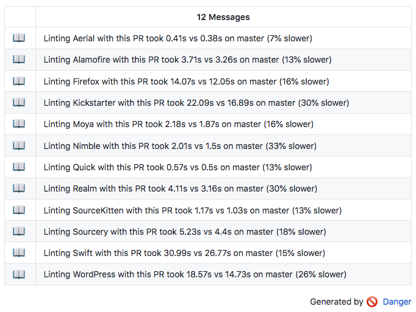

# Native Rule Tutorial

## Overview

SwiftLint is an incredibly powerful tool.  However, creating native rules can be a bit of a mystery and requires a lot of time to figure out how everything works.  

This tutorial will guide you through the fundamentals of rule creation using different kinds of rules as examples.  It assumes you have Swift development experience and have configured `.swiftlint.yml` before.

## Table of Contents

* [Setup](#setup)
* [Workspace](#workspace)
* [Key Terminology](#key-terminology)
* [Building](#building)
  * [Building in Xcode](#building-in-xcode)
  * [Building with Command Line](#building-with-command-line)
* [Testing](#testing)
  * [Testing in Xcode](#testing-in-xcode)
  * [Testing with Command Line](#testing-with-command-line)
* [Debugging](#debugging)
* [Example Rule 1: Unwanted Imports](#unwanted-imports)
  * [Stubbing](#unwanted-imports-stubbing)
  * [Rule Description](#unwanted-imports-rule-description)
  * [Unconfigured Validation](#unwanted-imports-unconfigured-validation)
  * [Configured Validation](#unwanted-imports-configured-validation)
* [Performance Testing](#performance-testing)
  * [Checking Performance](#performance-testing-checking-performance)
  * [Improving Performance](#performance-testing-improving-performance)
     * [Regular Expression Implementation](#performance-testing-improving-performance-regex-implementation)
     * [Like ForceTry Implementation](#performance-testing-improving-performance-like-force-try)
* [Submitting a Pull Request](#pull-request-submitting)
  * [Ensuring tests still work](#pull-request-ensuring-tests-work)
  * [Updating CHANGELOG](#pull-request-updating-changelog)

## <a name="setup"></a>Setup

Clone the SwiftLint `master` branch to your local machine.

```bash
git clone https://github.com/realm/SwiftLint.git
```

Once the project is cloned you need to pull in the dependencies.  Navigate to where you cloned and run:

```bash
git submodule update --init --recursive
```

These dependencies are pulled in through a combination of [Git Submodules](https://git-scm.com/book/en/v2/Git-Tools-Submodules) and [Carthage](https://github.com/Carthage/Carthage).

Lastly you will need to install [Sourcery](https://github.com/krzysztofzablocki/Sourcery) which is used for code generation of certain file like auto-generated test suites for rule default configurations.  Installing using [Homebrew](https://brew.sh/) is the easiest. 

```bash
brew install sourcery
```

**Note: If you are building with Xcode 10 or above, you need to run `make install`.**

**Building with the Xcode 10.1 toolchain may fail due to CryptoSwift.  If this occurs, use `xcode-select` to switch to the Xcode 10.0 toolchain.**

## <a name="workspace"></a>Workspace

Now that you have all of the dependencies needed to build, open the `SwiftLint.xcworkspace`.  This contains all of the projects needed to compile and build new rules.

* **SwiftLint**: Code specific to SwiftLint:
  * **swiftlint**: Command Line Interface.  For the most part you won't have to deal with this too much.
  * **SwiftLintFramework**: Framework that does the parsing, validating, and fixing.  This is where native rules exist.
* **[sourcekitten](https://github.com/jpsim/SourceKitten)**: Framework that simplifies interacting with SourceKit and provides Abstract Syntax Tree parsing.
* **[Commandant](https://github.com/Carthage/Commandant)**: Tool for writing Command Line Interfaces.
* **[Result](https://github.com/antitypical/Result.git)**: Result enum with success and failure cases.
* **[SWXMLHash](https://github.com/drmohundro/SWXMLHash.git)**: XML parser.
* **[SwiftyTextTable](https://github.com/scottrhoyt/SwiftyTextTable.git)**: Tool for pretty printing tables.
* **[Yams](https://github.com/jpsim/Yams)**: YAML parser.

## <a name="key-terminology"></a>Key Terminology

Before you can actually start working on a new rule, you need to understand some of the terminology SwiftLintFramework uses.

|Term|Definition|
|----|----------|
|File|Contents, structure, and syntax of code that will be linted|
|Location|File and offset of where something occurs|
|StyleViolation|Problem that was found and provides information about: what the violation is, where it was found, and severity|
|Rule|Performs validation of a single file looking for one or more related problems or violations|
|RuleDescription|Human readable information about what the rule does and examples that will trigger and not trigger violations|
|OptInRule|Rule that must be explicitly enabled in your configuration before it will be used|
|RuleConfiguration|Configuration information for a rule that can be customized to provide additional information like: severity level, line lengths, etc|
|ConfigurationProviderRule|Rule that uses some kind of configuration|
|CorrectableRule|Rule that can modify a file to correct a violation automatically|
|ASTRule|Rule that uses information from the parsed Abstract Syntax Tree of a file|
|Linter|Iterates over a file and checks for rule violations|

## <a name="building"></a>Building

Now that you have the project pulled down you should build it both in Xcode and by command line.  Building in Xcode is important because it will help you debug issues.  Building by command line is important because it is how CI will build and test your Pull Requests.  Please see the [Contributing Guide](CONTRIBUTING.md) for more information.

### <a name="building-in-xcode"></a>Building in Xcode

Simply select the `swiftlint` scheme and then build.  This will build all dependencies and then build the `swiftlint` command line tool.

### <a name="building-with-command-line"></a>Building with Command Line

Make sure you are in the root directory of the project and run:

```bash
script/cibuild
```

This will build and run tests to make the actual `swiftlint` command line executable.

## <a name="testing"></a>Testing

All Rules in SwiftLint have some kind of tests to validate their functionality.  Most rules use the `nonTriggeringExamples` and `triggeringExamples` to validate they are working properly.  For now we will focus on testing the existing rules.

### <a name="testing-in-xcode"></a>Testing in Xcode

Simply select the `swiftlint` scheme and then test.  This will run all of the tests that have been added to the `SwiftLintFrameworkTests` target.  Running individual tests is also supported using Xcode's normal play button next to an individual test case or test function.

### <a name="testing-with-command-line"></a>Testing with Command Line

Make sure you are in the root directory of the project and run:

```bash
swift test
make docker_test
```

This will make sure that all tests are running properly when CI builds and tests.

**Note: You will need [Docker](https://www.docker.com/) installed for `make docker_test` to work properly.**

## <a name="debugging"></a>Debugging

Debugging a rule is fairly simple for the most part.  Just set breakpoints as usual.  

**Note: When testing on Xcode 9.1 and below there may occationally be an extra breakpoint caused by the `swiftlint` process before you get to any breakpoints you have setup.  Just continue past this first breakpoint and everything should work as normal.**

## <a name="unwanted-imports"></a>Example Rule 1: Unwanted Imports

Lets say you are working on a framework that is not supposed to have any User Interface components.  Naturally you would want to make sure nothing like `UIKit` or `Cocoa` get imported in any file.  It would be nice if there was a rule that could do this. You could use a `custom_rule` that uses a regex to look for these, but that wouldn't be any fun.

### <a name="unwanted-imports-stubbing"></a>Stubbing

Before you can really do anything, we need to create the rule itself, add it to the master rules list, and add a test for it.  In `SwiftLintFramework/Rules/Style` create a new Swift file.  Name it `UnwantedImportsRule.swift`.  

**Make sure that it is added to the `SwiftLintFramework` target and not `swiftlint`.**

Paste the following into your new rule:

```swift
import Foundation
import SourceKittenFramework

public struct UnwantedImportsRule: ConfigurationProviderRule, OptInRule, ASTRule {
    public typealias KindType = SwiftDeclarationKind

    public var configuration = SeverityConfiguration(.warning)

    public init() {}

    public static let description = RuleDescription(
        identifier: "unwanted_imports",
        name: "Unwanted Imports",
        description: "Imports that are unwanted should be removed.",
        kind: .style,
        nonTriggeringExamples: [],
        triggeringExamples: []
    )

    public func validate(file: File, kind: KindType, dictionary: [String: SourceKitRepresentable]) -> [StyleViolation] {
        return []
    }
}
```
> Stubbed Rule

Now that you have a skeleton of a rule you have to register it with the framework using `Sourcery`:

```bash
make sourcery
```

This will automatically add your rule to the `SwiftLintFramework/Models/MasterRuleList.swift` and generate a basic test class in `SwiftLintFrameworkTests/AutomaticRuleTests.generated.swift` if your rule conforms to AutomaticTestableRule.  It will look something like:

```swift
class UnwantedImportsRuleTests: XCTestCase {
    func testWithDefaultConfiguration() {
        verifyRule(UnwantedImportsRule.description)
    }
}
```

**Note: In previous versions of SwiftLint you would have to add your rule manually to `SwiftLintFramework/Models/MasterRuleList.swift` and `SwiftLintFrameworkTests/RulesTests.swift`.  This is now generated using `Sourcery`.**

> Simple Test Case

Now run `testWithDefaultConfiguration`.  You will see that everything compiled and the test was run.  You shouldn't have any errors or failed tests because you don't have any triggering/nontriggering examples yet.

### <a name="unwanted-imports-rule-description"></a>Rule Description

Before we move onto writing the logic for the rule, we must understand the rule's description.  Every rule must have a description.  It defines: unique identifier, readable name, what it's supposed to do, what kind of rule, and examples that trigger and don't trigger.

```swift
public static let description = RuleDescription(
	identifier: "unwanted_imports",
	name: "Unwanted Imports",
	description: "Imports that are unwanted should be removed.",
	kind: .style,
	nonTriggeringExamples: [],
	triggeringExamples: []
)
```
> Bare Rule Description

Let's go over these options one by one:

* **identifier**: Unique identifier for the rule.  This allows the rule to be identified when configuring your `.swiftlint.yml`.  It also is what allows your rule to be temporarily disables using `// swiftlint:disable` comments.
* **name**: Name printed in the Rules command.
* **description**: Description printed in the Rules command.
* **kind**: What general category(type) of rule this is.  These are defined in the `RuleKind` enum.  In our rule we are using `style` because not wanting an import is more of a team/style convention.
* **nonTriggeringExamples**: Array that contains examples that shouldn't trigger violations.
* **triggeringExamples**: Array that contain examples that should trigger violations.

If you remember `UnwantedImportsRuleTests.testWithDefaultConfiguration`, we used the `verifyRule` function which was passed the rules description.  `verifyRule` uses the triggering and non triggering examples to create examples of code to verify the rule is working as intended.

Lets fill out some triggering and nontriggering examples that don't allow `UIKit` and `UnwantedFramework` frameworks to be imported.

```swift
public static let description = RuleDescription(
    identifier: "unwanted_imports",
    name: "Unwanted Imports",
    description: "Imports that are unwanted should be removed.",
    kind: .style,
    nonTriggeringExamples: [
        "import Foundation",
        "import MyFramework",
        "@testable import MyFramework",
        "// import UIKit",
        "// @testable import UIKit",
        "// import UnwantedFramework",
        "// @testable import UnwantedFramework"
    ],
    triggeringExamples: [
        "import UIKit",
        "@testable import UIKit",
        "import UnwantedFramework",
        "@testable import UnwantedFramework"
    ]
)
```
> Rule Description with Examples

Rerun `UnwantedImportsRuleTests.testWithDefaultConfiguration`.  You should now see a bunch of assertions like:

```
failed - triggeringExample did not violate: 
'''
import UnwantedFramework
'''
```

```
failed - triggeringExample did not violate: 
'''
#!/usr/bin/env swift
import UIKit
'''
```

`verifyRule` has iterated over the examples and created files(not real files, just the File type) and run them against your rule.

### <a name="unwanted-imports-unconfigured-validation"></a>Unconfigured Validation

Now that we have failing tests, let's write the logic to find violations.  If you look at the rules conformance you will see `ConfigurationProviderRule`, `OptInRule`, and `ASTRule`.  These protocols indicate the rule has configuration options, is not run unless specifically configured in `.swiftlint.yml`, and is an Abstract Syntax Tree rule.  For now we're going to leave the configuration alone and focus on the validation.

The `Rule` protocol only provides a simple view into a `File` when validating.  This is useful if you aren't validating anything based off Swift syntax.  Our rule is looking at syntax so we are an `ASTRule`.

`ASTRule` provides a more focused validation method that will only be called for a specific kind of syntax parsed by `SourceKittenFramework`.  These kinds are defined in `SourceKittenFramework` in a few different enums:

* **ObjCDeclarationKind**: These correspond to Objective-C specific syntax strings prefixed by `sourcekitten.source.lang.objc`.
* **SwiftDeclarationKind**: These correspond to specific types of Swift declaration strings prefixed by `source.lang.swift.decl`.
* **SyntaxKind**: These correspond to `SourceKit` defined language syntax strings prefixed by `source.lang.swift.syntaxtype`.

If you look at the rule so far you will see `public typealias KindType = SwiftDeclarationKind`.  This is indicating that we want to only validate declaration kinds in our rule.

Set a breakpoint at the return in our rules `validate` function and run `UnwantedImportsRuleTests.testWithDefaultConfiguration`.  You should notice that the breakpoint is never reached.

Lets add the base `validate` function to our rule and see if we can identify why the `ASTRule` `validate` isn't being called.  Add:

```swift
public func validate(file: File) -> [StyleViolation] {
    return []
}
```
> `validate` function from Rule Protocol.

This allows us to temporarily override the implementation provided by `ASTRule` to see the files structure.

Set a breakpoint at return of the more simple `validate` function and rerun `UnwantedImportsRuleTests.testWithDefaultConfiguration`.  In the debuggers `Variables View` you should see the file and it's contents is one of the examples above.  So we know our rule is being picked up but we aren't making it into the AST part of the rule.  

**Note: If it still isn't hitting the breakpoint make sure you added the new rule to the master rules list.**

If you look at the source for `ASTRule` you will see it's default `validation` implementation is using the parsed `structure` of the file.  Print out the value of the `structure` in the debugger.  It should look something like:

```
(lldb) po file.structure
▿ {
  "key.diagnostic_stage" : "source.diagnostic.stage.swift.parse",
  "key.length" : 17,
  "key.offset" : 0,
  "key.substructure" : [

  ]
}
  ▿ dictionary : 4 elements
    ▿ 0 : 2 elements
      - key : "key.diagnostic_stage"
      - value : "source.diagnostic.stage.swift.parse"
    ▿ 1 : 2 elements
      - key : "key.substructure"
      - value : 0 elements
    ▿ 2 : 2 elements
      - key : "key.offset"
      - value : 0
    ▿ 3 : 2 elements
      - key : "key.length"
      - value : 17
```
> lldb output of File Structure with emphasis on dictionary

If you look closely, there are no substructures or elements for an abstract syntax tree in there.  That means our rule probably shouldn't conform to `ASTRule`.  

Take a look at the files `syntaxMap` instead:

```
(lldb) po file.syntaxMap
▿ [
  {
    "length" : 6,
    "offset" : 0,
    "type" : "source.lang.swift.syntaxtype.keyword"
  },
  {
    "length" : 10,
    "offset" : 7,
    "type" : "source.lang.swift.syntaxtype.identifier"
  }
]
  ▿ tokens : 2 elements
    ▿ 0 : {
  "length" : 6,
  "offset" : 0,
  "type" : "source.lang.swift.syntaxtype.keyword"
}
      - type : "source.lang.swift.syntaxtype.keyword"
      - offset : 0
      - length : 6
    ▿ 1 : {
  "length" : 10,
  "offset" : 7,
  "type" : "source.lang.swift.syntaxtype.identifier"
}
      - type : "source.lang.swift.syntaxtype.identifier"
      - offset : 7
      - length : 10
```
> lldb output of SyntaxMap with emphasis on tokens

Notice in the `tokens` array there is a keyword and a identifier token found.  Let's modify our rule to see if we can figure out the contents of the keyword.

```swift
public struct UnwantedImportsRule: ConfigurationProviderRule, OptInRule {
    struct FoundToken {
        let index: Int
        let token: SyntaxToken
        let content: String
    }
    
    public var configuration = SeverityConfiguration(.warning)

    public init() {}
    
    public static let description = RuleDescription(
        identifier: "unwanted_imports",
        name: "Unwanted Imports",
        description: "Imports that are unwanted should be removed.",
        kind: .style,
        nonTriggeringExamples: [
            "import Foundation",
            "import MyFramework",
            "@testable import MyFramework",
            "// import UIKit",
            "// @testable import UIKit",
            "// import UnwantedFramework",
            "// @testable import UnwantedFramework"
        ],
        triggeringExamples: [
            "import UIKit",
            "@testable import UIKit",
            "import UnwantedFramework",
            "@testable import UnwantedFramework"
        ]
    )
    
    public func validate(file: File) -> [StyleViolation] {
        let foundKeywords = find(keywordsIn: file)
        _ = foundKeywords
        return []
    }
    
    func find(keywordsIn file: File) -> [FoundToken] {
        let contents = file.contents.bridge()
        var found: [FoundKeyword] = []
        
        for (index, token) in file.syntaxMap.tokens.enumerated() where token.type == SyntaxKind.keyword.rawValue {
            guard let range = contents.byteRangeToNSRange(start: token.offset, length: token.length) else {
                continue
            }
            
            found(FoundToken(index: index, token: token, content: contents.substring(with: range)))
        }
        
        return found
    }
}
```
> UnwantedImportsRule that can only find keywords

**Note: Notice that when retrieving the actual string in the tokens range the string is bridged.  This is done because SourceKit returns the offset and lengths based off NSString's index and ranges.  If you don't work with it as an NSString then you can crash because of multibyte characters being indexed differently.**

Set a breakpoint at the return of `validate` and rerun `UnwantedImportsRuleTests.testWithDefaultConfiguration`.  In the debugger print out the value of `foundKeywords`:

```
(lldb) po foundKeywords
▿ 1 element
  ▿ 0 : FoundKeyword
    - index : 0
    ▿ token : {
  "length" : 6,
  "offset" : 0,
  "type" : "source.lang.swift.syntaxtype.keyword"
}
      - type : "source.lang.swift.syntaxtype.keyword"
      - offset : 0
      - length : 6
    - keyword : "import"
```
> lldb output showing keyword has been parsed

Now we can see that there is an import keyword that has been found.  Now lets adjust our rule so we find only `import` keywords.

```swift
public struct UnwantedImportsRule: ConfigurationProviderRule, OptInRule {
    struct FoundToken {
        let index: Int
        let token: SyntaxToken
        let content: String
    }
    
    public var configuration = SeverityConfiguration(.warning)

    public init() {}
    
    public static let description = RuleDescription(
        identifier: "unwanted_imports",
        name: "Unwanted Imports",
        description: "Imports that are unwanted should be removed.",
        kind: .style,
        nonTriggeringExamples: [
            "import Foundation",
            "import MyFramework",
            "@testable import MyFramework",
            "// import UIKit",
            "// @testable import UIKit",
            "// import UnwantedFramework",
            "// @testable import UnwantedFramework"
        ],
        triggeringExamples: [
            "import UIKit",
            "@testable import UIKit",
            "import UnwantedFramework",
            "@testable import UnwantedFramework"
        ]
    )
    
    public let importKeyword = "import"
    
    public func validate(file: File) -> [StyleViolation] {
        let foundImportKeywords = find(importKeywordsIn: file)
        _ = foundImportKeywords
        
        return []
    }
    
    func find(importKeywordsIn file: File) -> [FoundToken] {
        let contents = file.contents.bridge()
        var found: [FoundToken] = []
        
        for (index, token) in file.syntaxMap.tokens.enumerated() where token.type == SyntaxKind.keyword.rawValue {
            guard let range = contents.byteRangeToNSRange(start: token.offset, length: token.length) else {
                continue
            }
            
            let keyword = contents.substring(with: range)
            
            guard keyword == importKeyword else {
                continue
            }
            
            found.append(FoundToken(index: index, token: token, content: keyword))
        }
        
        return found
    }
}
```
> UnwantedImportsRule that can only identify the `import` keyword

We can now identify the `import` keyword.  Now lets modify our rule to find identifiers.

```swift
public struct UnwantedImportsRule: ConfigurationProviderRule, OptInRule {
    struct FoundToken {
        let index: Int
        let token: SyntaxToken
        let content: String
    }
    
    public var configuration = SeverityConfiguration(.warning)

    public init() {}
    
    public static let description = RuleDescription(
        identifier: "unwanted_imports",
        name: "Unwanted Imports",
        description: "Imports that are unwanted should be removed.",
        kind: .style,
        nonTriggeringExamples: [
            "import Foundation",
            "import MyFramework",
            "@testable import MyFramework",
            "// import UIKit",
            "// @testable import UIKit",
            "// import UnwantedFramework",
            "// @testable import UnwantedFramework"
        ],
        triggeringExamples: [
            "import UIKit",
            "@testable import UIKit",
            "import UnwantedFramework",
            "@testable import UnwantedFramework"
        ]
    )
    
    public let importKeyword = "import"
    
    public func validate(file: File) -> [StyleViolation] {
        let foundImportKeywords = find(importKeywordsIn: file)
        _ = foundImportKeywords
        
        let foundIdentifiers = find(identifiersIn: file)
        _ = foundIdentifiers
        
        return []
    }

    func find(identifiersIn file: File) -> [FoundToken] {
        let contents = file.contents.bridge()
        var found: [FoundToken] = []
        
        for (index, token) in file.syntaxMap.tokens.enumerated() where token.type == SyntaxKind.identifier.rawValue {
            guard let range = contents.byteRangeToNSRange(start: token.offset, length: token.length) else {
                continue
            }
            
            found.append(FoundToken(index: index, token: token, content: contents.substring(with: range)))
        }
        
        return found
    }

    func find(importKeywordsIn file: File) -> [FoundToken] {
        let contents = file.contents.bridge()
        var found: [FoundToken] = []
        
        for (index, token) in file.syntaxMap.tokens.enumerated() where token.type == SyntaxKind.keyword.rawValue {
            guard let range = contents.byteRangeToNSRange(start: token.offset, length: token.length) else {
                continue
            }
            
            let keyword = contents.substring(with: range)
            
            guard keyword == importKeyword else {
                continue
            }
            
            found.append(FoundToken(index: index, token: token, content: keyword))
        }
        
        return found
    }
}
```
> UnwantedImportsRule that can find `import` keywords and identifiers

With the import statement and module identifiers found.  It now should be simple to find import statements by comparing the index of the tokens found which should be a keyword token followed by an identifier token.

```swift
public struct UnwantedImportsRule: ConfigurationProviderRule, OptInRule {
    struct FoundToken {
        let index: Int
        let token: SyntaxToken
        let content: String
    }
    
    struct FoundImport {
        let keywordToken: FoundToken
        let identifierToken: FoundToken
    }
    
    public var configuration = SeverityConfiguration(.warning)

    public init() {}
    
    public static let description = RuleDescription(
        identifier: "unwanted_imports",
        name: "Unwanted Imports",
        description: "Imports that are unwanted should be removed.",
        kind: .style,
        nonTriggeringExamples: [
            "import Foundation",
            "import MyFramework",
            "@testable import MyFramework",
            "// import UIKit",
            "// @testable import UIKit",
            "// import UnwantedFramework",
            "// @testable import UnwantedFramework"
        ],
        triggeringExamples: [
            "import UIKit",
            "@testable import UIKit",
            "import UnwantedFramework",
            "@testable import UnwantedFramework"
        ]
    )
    
    public let importKeyword = "import"
    
    public func validate(file: File) -> [StyleViolation] {
        let foundImports = find(importsIn: file)
        _ = foundImports
        return []
    }
    
    func find(importsIn file: File) -> [FoundImport] {
        let foundTokens: [FoundToken] = find(importKeywordsIn: file) + find(identifiersIn: file)
        let sortedTokens = foundTokens.sorted { (lhs, rhs) -> Bool in
            return lhs.index < rhs.index
        }
        
        var found: [FoundImport] = []
        
        for (index, token) in sortedTokens.enumerated() {
            guard token.token.type == SyntaxKind.keyword.rawValue,
                index < sortedTokens.count - 1,
                sortedTokens[index + 1].token.type == SyntaxKind.identifier.rawValue else {
                continue
            }
            
            found.append(FoundImport(keywordToken: token, identifierToken: sortedTokens[index + 1]))
        }
        
        return found
    }

    func find(identifiersIn file: File) -> [FoundToken] {
        let contents = file.contents.bridge()
        var found: [FoundToken] = []
        
        for (index, token) in file.syntaxMap.tokens.enumerated() where token.type == SyntaxKind.identifier.rawValue {
            guard let range = contents.byteRangeToNSRange(start: token.offset, length: token.length) else {
                continue
            }
            
            found.append(FoundToken(index: index, token: token, content: contents.substring(with: range)))
        }
        
        return found
    }

    func find(importKeywordsIn file: File) -> [FoundToken] {
        let contents = file.contents.bridge()
        var found: [FoundToken] = []
        
        for (index, token) in file.syntaxMap.tokens.enumerated() where token.type == SyntaxKind.keyword.rawValue {
            guard let range = contents.byteRangeToNSRange(start: token.offset, length: token.length) else {
                continue
            }
            
            let keyword = contents.substring(with: range)
            
            guard keyword == importKeyword else {
                continue
            }
            
            found.append(FoundToken(index: index, token: token, content: keyword))
        }
        
        return found
    }
}
```
> UnwantedImportsRule that can groups an `import` keyword followed by an identifier

With the imports identified, we can now create the violations if the module that was imported is unwanted.

```swift
public struct UnwantedImportsRule: ConfigurationProviderRule, OptInRule {
    struct FoundToken {
        let index: Int
        let token: SyntaxToken
        let content: String
    }
    
    struct FoundImport {
        let keywordToken: FoundToken
        let identifierToken: FoundToken
        
        var module: String {
            return identifierToken.content
        }
    }
    
    public var configuration = SeverityConfiguration(.warning)

    public init() {}
    
    public static let description = RuleDescription(
        identifier: "unwanted_imports",
        name: "Unwanted Imports",
        description: "Imports that are unwanted should be removed.",
        kind: .style,
        nonTriggeringExamples: [
            "import Foundation",
            "import MyFramework",
            "@testable import MyFramework",
            "// import UIKit",
            "// @testable import UIKit",
            "// import UnwantedFramework",
            "// @testable import UnwantedFramework"
        ],
        triggeringExamples: [
            "import UIKit",
            "@testable import UIKit",
            "import UnwantedFramework",
            "@testable import UnwantedFramework"
        ]
    )
    
    public let importKeyword = "import"
    public var unwantedImports = ["UIKit", "UnwantedFramework"]
    
    public func validate(file: File) -> [StyleViolation] {
        var violations: [StyleViolation] = []
        
        find(importsIn: file).forEach { foundImport in
            guard unwantedImports.contains(foundImport.module) else {
                return
            }
            
            violations.append(violation(for: foundImport, in: file))
        }
        
        return violations
    }
    
    func violation(for foundImport: FoundImport, in file: File) -> StyleViolation {
        return StyleViolation(
            ruleDescription: type(of: self).description,
            severity: configuration.severity,
            location: Location(file: file, characterOffset: foundImport.keywordToken.token.offset),
            reason: "\"\(foundImport.module)\" should not be imported")
    }
    
    func find(importsIn file: File) -> [FoundImport] {
        let foundTokens: [FoundToken] = find(importKeywordsIn: file) + find(identifiersIn: file)
        let sortedTokens = foundTokens.sorted { (lhs, rhs) -> Bool in
            return lhs.index < rhs.index
        }
        
        var found: [FoundImport] = []
        
        for (index, token) in sortedTokens.enumerated() {
            guard token.token.type == SyntaxKind.keyword.rawValue,
                index < sortedTokens.count - 1,
                sortedTokens[index + 1].token.type == SyntaxKind.identifier.rawValue else {
                continue
            }
            
            found.append(FoundImport(keywordToken: token, identifierToken: sortedTokens[index + 1]))
        }
        
        return found
    }

    func find(identifiersIn file: File) -> [FoundToken] {
        let contents = file.contents.bridge()
        var found: [FoundToken] = []
        
        for (index, token) in file.syntaxMap.tokens.enumerated() where token.type == SyntaxKind.identifier.rawValue {
            guard let range = contents.byteRangeToNSRange(start: token.offset, length: token.length) else {
                continue
            }
            
            found.append(FoundToken(index: index, token: token, content: contents.substring(with: range)))
        }
        
        return found
    }

    func find(importKeywordsIn file: File) -> [FoundToken] {
        let contents = file.contents.bridge()
        var found: [FoundToken] = []
        
        for (index, token) in file.syntaxMap.tokens.enumerated() where token.type == SyntaxKind.keyword.rawValue {
            guard let range = contents.byteRangeToNSRange(start: token.offset, length: token.length) else {
                continue
            }
            
            let keyword = contents.substring(with: range)
            
            guard keyword == importKeyword else {
                continue
            }
            
            found.append(FoundToken(index: index, token: token, content: keyword))
        }
        
        return found
    }
}
```
> UnwantedImportsRule that successfully finds unwanted imports

If you now rerun `UnwantedImportsRuleTests.testWithDefaultConfiguration` your rule is working as expected.  Congratulations!!!!!

### <a name="unwanted-imports-configured-validation"></a>Configured Validation

Now that your rule works, it would be more powerful if you could provide the module names and severity level through your `.swiftlint.yml` so it has something like: 

```yaml
opt_in_rules:
  - unwanted_imports

unwanted_imports:
  UIKit: warning
  UnwantedFramework: error
```
> Desired configuration in `.swiftlint.yml` for UnwantedImportsRule

In `SwiftLintFramework/Rules/RuleConfigurations` create `UnwantedImportsConfiguration.swift`.  This will be the custom configuration our rule will use.  It will contain a dictionary of module identifiers and the severity level for that specific import violation.  Copy this code into that file:

```swift
import Foundation

public struct UnwantedImportsConfiguration: RuleConfiguration, Equatable {
    var unwantedImports: [String: ViolationSeverity] = [:]
    
    public var consoleDescription: String  = ""
    
    public mutating func apply(configuration: Any) throws {
        throw ConfigurationError.unknownConfiguration
    }
    
    public static func ==(lhs: UnwantedImportsConfiguration, rhs: UnwantedImportsConfiguration) -> Bool {
        return lhs.unwantedImports == rhs.unwantedImports
    }
}
```
> Stubbed custom configuration for UnwantedImportsRule

This creates a simple configuration that right now doesn't do anything.  The important part of this code is the `apply` function.  SwiftLint automatically parses the `.swiftlint.yml` file into standard Swift types and provides your configuration the parsed data.  It is your job to then use those standard types for your configuration.  If you don't recognize the data you should throw a ConfigurationError.unknownConfiguration error.

Since we essentially are working with a dictionary of Strings, lets add some basic parsing to this configuration.

```swift
public struct UnwantedImportsConfiguration: RuleConfiguration, Equatable {
    let errorKeyword = "error"
    var unwantedImports: [String: ViolationSeverity] = [:]
    
    public var consoleDescription: String = ""
    
    public mutating func apply(configuration: Any) throws {
        guard let config = configuration as? [String: String] else {
            throw ConfigurationError.unknownConfiguration
        }
        
        register(unwantedImports: config)
    }
    
    mutating func register(unwantedImports: [String: String]) {
        for (module, severity) in unwantedImports {
            self.unwantedImports[module] = (severity == errorKeyword) ? ViolationSeverity.error : ViolationSeverity.warning
        }
    }
    
    public static func ==(lhs: UnwantedImportsConfiguration, rhs: UnwantedImportsConfiguration) -> Bool {
        return lhs.unwantedImports == rhs.unwantedImports
    }
}
```
> Configuration that can map a module name and severity

All this is doing is using the dictionarys key as the module name and the value is parsed to match a severity level.  Believe it or not we are almost done with the configuration.  The last thing we want to do is provide a useful `consoleDescription`.  This will be printed in the table when you run the Rules command.  For this rule it would be nice if it told us the configured names of the modules were and their severity level.  Lets add that.

```swift
public struct UnwantedImportsConfiguration: RuleConfiguration, Equatable {
	let errorKeyword = "error"
    var unwantedImports: [String: ViolationSeverity] = [:]
    
    public var consoleDescription: String {
        let imports = self.unwantedImports.sorted(by: { $0.key < $1.key }) .flatMap { module, severity in
            return "[module: \"\(module)\", severity: \(severity.rawValue)]]"
        }.joined(separator: ", ")
        
        let instructions = "No unwanted imports configured.  In config add 'unwanted_imports' to 'opt_in_rules' and " +
                           "config using :\n\n" +
                           "'unwanted_imports:\n" +
                           "  {Module Name}:{warning|error}\n"
        
        return imports.isEmpty ? instructions : imports
    }
    
    public mutating func apply(configuration: Any) throws {
        guard let config = configuration as? [String: String] else {
            throw ConfigurationError.unknownConfiguration
        }
        
        register(unwantedImports: config)
    }
    
    mutating func register(unwantedImports: [String: String]) {
        for (module, severity) in unwantedImports {
            self.unwantedImports[module] = (severity == errorKeyword) ? ViolationSeverity.error : ViolationSeverity.warning
        }
    }
    
    public static func ==(lhs: UnwantedImportsConfiguration, rhs: UnwantedImportsConfiguration) -> Bool {
        return lhs.unwantedImports == rhs.unwantedImports
    }
}
```
> Completed UnwantedImportsRule configuration

Our configuration is now complete.  We now need to modify our rule to use this configuration.  Because these changes are small I am going to provide the final version of the rule.

```swift
public struct UnwantedImportsRule: ConfigurationProviderRule, OptInRule {
    struct FoundToken {
        let index: Int
        let token: SyntaxToken
        let content: String
    }
    
    struct FoundImport {
        let keywordToken: FoundToken
        let identifierToken: FoundToken
        
        var module: String {
            return identifierToken.content
        }
    }
    
    public var configuration = UnwantedImportsConfiguration()

    public init() {}
    
    public static let description = RuleDescription(
        identifier: "unwanted_imports",
        name: "Unwanted Imports",
        description: "Imports that are unwanted should be removed.",
        kind: .style,
        nonTriggeringExamples: [
            "import Foundation",
            "import MyFramework",
            "@testable import MyFramework",
            "// import UIKit",
            "// @testable import UIKit",
            "// import UnwantedFramework",
            "// @testable import UnwantedFramework"
        ],
        triggeringExamples: [
            "import UIKit",
            "@testable import UIKit",
            "import UnwantedFramework",
            "@testable import UnwantedFramework"
        ]
    )
    
    public let importKeyword = "import"
    
    public func validate(file: File) -> [StyleViolation] {
        var violations: [StyleViolation] = []
        
        find(importsIn: file).forEach { foundImport in
            guard configuration.unwantedImports.keys.contains(foundImport.module) else {
                return
            }
            
            violations.append(violation(for: foundImport, in: file))
        }
        
        return violations
    }
    
    func violation(for foundImport: FoundImport, in file: File) -> StyleViolation {
        let severity = configuration.unwantedImports[foundImport.module] ?? .warning
        
        return StyleViolation(
            ruleDescription: type(of: self).description,
            severity: severity,
            location: Location(file: file, characterOffset: foundImport.keywordToken.token.offset),
            reason: "\"\(foundImport.module)\" should not be imported")
    }
    
    func find(importsIn file: File) -> [FoundImport] {
        let foundTokens: [FoundToken] = find(importKeywordsIn: file) + find(identifiersIn: file)
        let sortedTokens = foundTokens.sorted { (lhs, rhs) -> Bool in
            return lhs.index < rhs.index
        }
        
        var found: [FoundImport] = []
        
        for (index, token) in sortedTokens.enumerated() {
            guard token.token.type == SyntaxKind.keyword.rawValue,
                index < sortedTokens.count - 1,
                sortedTokens[index + 1].token.type == SyntaxKind.identifier.rawValue else {
                continue
            }
            
            found.append(FoundImport(keywordToken: token, identifierToken: sortedTokens[index + 1]))
        }
        
        return found
    }

    func find(identifiersIn file: File) -> [FoundToken] {
        let contents = file.contents.bridge()
        var found: [FoundToken] = []
        
        for (index, token) in file.syntaxMap.tokens.enumerated() where token.type == SyntaxKind.identifier.rawValue {
            guard let range = contents.byteRangeToNSRange(start: token.offset, length: token.length) else {
                continue
            }
            
            found.append(FoundToken(index: index, token: token, content: contents.substring(with: range)))
        }
        
        return found
    }

    func find(importKeywordsIn file: File) -> [FoundToken] {
        let contents = file.contents.bridge()
        var found: [FoundToken] = []
        
        for (index, token) in file.syntaxMap.tokens.enumerated() where token.type == SyntaxKind.keyword.rawValue {
            guard let range = contents.byteRangeToNSRange(start: token.offset, length: token.length) else {
                continue
            }
            
            let keyword = contents.substring(with: range)
            
            guard keyword == importKeyword else {
                continue
            }
            
            found.append(FoundToken(index: index, token: token, content: keyword))
        }
        
        return found
    }
}
```
> Completed UnwantedImportsRule

The only things that had to change for our rule were the actual configuration type, where the module names were stored, and the severity level of the violation.

Now rerun `UnwantedImportsRuleTests.testWithDefaultConfiguration` your rule.  Whoops, it's now failing.  This is caused by our rule previously having the unwanted import names stored in the rule.  They are now in the configuration and your test doesn't have them configured anymore.  To fix this we are going to create a dedicated test file since `AutomaticRuleTests.generated.swift` will remove out configuration every time it's rebuilt.

Create a new file named `UnwantedImportsRuleTests.swift` in `SwiftLintFrameworkTests` and make sure it is added to the `SwiftLintFramework` target.  Move the autogenerated test case from `AutomaticRuleTests.generated.swift` into your new file.  It should look something like this:

```swift
import SwiftLintFramework
import XCTest

class UnwantedImportsRuleTests: XCTestCase {
    func testWithDefaultConfiguration() {
        verifyRule(UnwantedImportsRule.description)
    }
}
```

Now add some configuration information which should be the parsed version of what would normally be in a `YAML` file:

```swift
func testWithDefaultConfiguration() {
    let configuration = ["UIKit": "warning", "UnwantedFramework": "error"]
    verifyRule(UnwantedImportsRule.description, ruleConfiguration: configuration)
}
```
> Updated test case with configuration

If you now rerun `UnwantedImportsRuleTests.testWithDefaultConfiguration` your rule is working as expected.  Congratulations!!!!!  You have completed your first configurable native rule.

## <a name="performance-testing"></a>Performance Testing

The last thing you should do before submitting a Pull Request is determine how your rule will affect performance.

#### <a name="performance-testing-checking-performance"></a>Checking Performance

`script/oss-check` clones popular Swift repos and run the latest version of SwiftLint and your version to compare how long each takes.  It will then give a nice print out so you can see the difference for each library.

```bash
script/oss-check -v 2
```

```bash
Message: Linting Aerial with this PR took 0.37s vs 0.35s on master (5% slower)
Message: Linting Alamofire with this PR took 2.81s vs 2.45s on master (14% slower)
Message: Linting Firefox with this PR took 11.63s vs 10.21s on master (13% slower)
Message: Linting Kickstarter with this PR took 16.7s vs 15.13s on master (10% slower)
Message: Linting Moya with this PR took 1.67s vs 1.57s on master (6% slower)
Message: Linting Nimble with this PR took 1.51s vs 1.39s on master (8% slower)
Message: Linting Quick with this PR took 0.46s vs 0.43s on master (6% slower)
Message: Linting Realm with this PR took 2.99s vs 2.83s on master (5% slower)
Message: Linting SourceKitten with this PR took 0.96s vs 0.97s on master (1% faster)
Message: Linting Sourcery with this PR took 4.03s vs 3.71s on master (8% slower)
Message: Linting Swift with this PR took 24.92s vs 23.54s on master (5% slower)
Message: Linting WordPress with this PR took 15.0s vs 13.88s on master (8% slower)
```

**Note: If this readout looks familiar, it is the same thing `Danger` adds to all Pull Requests.**



#### <a name="performance-testing-improving-performance"></a>Improving Performance

As you can see, our new rule slowed down linting quite a bit.  This is probably a good time to revisit our code to see if we can speed it up.

My hypothesis for the slow rule is because the underlying code structure is checked in detail.  While this is great and logically correct, it does create a lot of code and overhead to constantly traverse tokens.  Essentially we just want to be able to catch a pattern of `import XXXX` or `@testable import XXXX`.  This is probably a good place for a simple Regular Expression.  

##### <a name="performance-testing-improving-performance-regex-implementation"></a>Regular Expression Implementation

Lets take a look at a second implementation that uses a Regular Expression over each line in the file.

```swift
import Foundation
import SourceKittenFramework

/// Creates violations when a module that is unwanted gets imported.
public struct UnwantedImportsRule: ConfigurationProviderRule, OptInRule {
    /// Holds the information for a found import.
    struct FoundImport {
        /// Line the import was found on.
        let line: Line

        /// Result that contains the information
        let result: NSTextCheckingResult

        /// Name of the module.
        var module: String {
            return (line.content as NSString).substring(with: result.range(at: 1))
        }

        /// Offset where the import was found
        var offset: Int {
            let nsRange = result.range(at: 1)
            let offsetRange = NSRange(location: line.range.location + nsRange.location, length: nsRange.length)
            return offsetRange.location
        }
    }

    public var configuration = UnwantedImportsConfiguration()

    public init() {}

    public static let description = RuleDescription(
        identifier: "unwanted_imports",
        name: "Unwanted Imports",
        description: "Imports that are unwanted should be removed.",
        kind: .style,
        nonTriggeringExamples: [
            "import Foundation",
            "import MyFramework",
            "@testable import MyFramework",
            "// import UIKit",
            "// @testable import UIKit",
            "// import UnwantedFramework",
            "// @testable import UnwantedFramework"
        ],
        triggeringExamples: [
            "import UIKit",
            "@testable import UIKit",
            "import UnwantedFramework",
            "@testable import UnwantedFramework"
        ]
    )

    // swiftlint:disable:next force_try
    public let importRegEx = try! NSRegularExpression(pattern: "import\\s+(.*)", options: [])
    public let commentBlockStart = "/*"
    public let commentBlockEnd = "*/"
    public let inlineCommentPrefix = "//"

    public func validate(file: File) -> [StyleViolation] {
        var violations: [StyleViolation] = []
        let foundImports: [FoundImport] = find(importsIn: file)

        for foundImport in foundImports where configuration.unwantedImports.keys.contains(foundImport.module) {
            violations.append(violation(for: foundImport, in: file))
        }

        return violations
    }

    /// Creates a violation for an unwanted import.
    ///
    /// - Parameters:
    ///   - foundImport: Information about the import that was found.
    ///   - file: File the import was found in.
    /// - Returns: Violation for the unwanted import.
    func violation(for foundImport: FoundImport, in file: File) -> StyleViolation {
        return StyleViolation(
            ruleDescription: type(of: self).description,
            severity: configuration.unwantedImports[foundImport.module] ?? .warning,
            location: Location(file: file, characterOffset: foundImport.offset),
            reason: "\"\(foundImport.module)\" should not be imported")
    }

    /// Finds all of the imports in a file using a regular expression
    ///
    /// - Parameter file: File containing possible imports.
    /// - Returns: Lines with all the imports in the file.
    func find(importsIn file: File) -> [FoundImport] {
        var found: [FoundImport] = []

        linesNotWithinCommentBlocks(in: file).forEach { line in
            let fullNSRange = line.content.fullNSRange

            guard let result = importRegEx.firstMatch(in: line.content, options: [], range: fullNSRange) else {
                return
            }

            let inlinePrefixRange = (line.content as NSString).range(of: inlineCommentPrefix)

            if inlinePrefixRange.location != NSNotFound, inlinePrefixRange.location < result.range.location {
                return
            }

            found.append(FoundImport(line: line, result: result))
        }

        return found
    }

    /// Finds all of the lines within the file that are not within comment blocks.
    ///
    /// Note: This is not meant to be perfect and is only meant to capture /*\nimport Something\n*/.
    ///
    /// - Parameter file: File containing possible imports.
    /// - Returns: Lines that were not found to be within comment blocks.
    func linesNotWithinCommentBlocks(in file: File) -> [Line] {
        var found: [Line] = []
        var isWithinComment: Bool = false

        file.lines.forEach { line in
            let trimmed = line.content.trimmingCharacters(in: .whitespaces)

            guard !trimmed.hasPrefix(commentBlockStart) else {
                isWithinComment = !trimmed.hasSuffix(commentBlockEnd)
                return
            }

            guard !trimmed.hasSuffix(commentBlockEnd) else {
                isWithinComment = false
                return
            }

            guard !isWithinComment else {
                return
            }

            found.append(line)
        }

        return found
    }
}
```

This implementation we've reduced most of the traversing and spend most of the code making sure we are ignoring comments.  It performed slightly better:

```bash
Message: Linting Aerial with this PR took 0.37s vs 0.34s on master (8% slower)
Message: Linting Alamofire with this PR took 2.69s vs 2.48s on master (8% slower)
Message: Linting Firefox with this PR took 10.86s vs 10.29s on master (5% slower)
Message: Linting Kickstarter with this PR took 15.63s vs 15.02s on master (4% slower)
Message: Linting Moya with this PR took 1.65s vs 1.57s on master (5% slower)
Message: Linting Nimble with this PR took 1.45s vs 1.39s on master (4% slower)
Message: Linting Quick with this PR took 0.43s vs 0.41s on master (4% slower)
Message: Linting Realm with this PR took 2.84s vs 2.78s on master (2% slower)
Message: Linting SourceKitten with this PR took 0.96s vs 0.92s on master (4% slower)
Message: Linting Sourcery with this PR took 3.93s vs 3.83s on master (2% slower)
Message: Linting Swift with this PR took 24.5s vs 23.82s on master (2% slower)
Message: Linting WordPress with this PR took 14.35s vs 14.43s on master (0% faster)
```

But there might still be a better way.  

##### <a name="performance-testing-improving-performance-like-force-try"></a>Like ForceTry Implementation

[Marcelo Fabri](https://github.com/marcelofabri)) suggested that looking at the `ForceTryRule` might be a good starting place.

```swift
import SourceKittenFramework

public struct ForceTryRule: ConfigurationProviderRule, AutomaticTestableRule {

    public var configuration = SeverityConfiguration(.error)

    public init() {}

    public static let description = RuleDescription(
        identifier: "force_try",
        name: "Force Try",
        description: "Force tries should be avoided.",
        kind: .idiomatic,
        nonTriggeringExamples: [
            "func a() throws {}; do { try a() } catch {}"
        ],
        triggeringExamples: [
            "func a() throws {}; ↓try! a()"
        ]
    )

    public func validate(file: File) -> [StyleViolation] {
        return file.match(pattern: "try!", with: [.keyword]).map {
            StyleViolation(ruleDescription: type(of: self).description,
                           severity: configuration.severity,
                           location: Location(file: file, characterOffset: $0.location))
        }
    }
}
```
> `ForceTryRule.swift`

Here we can see there are existing methods on `File` that let us match a Regular Expression against specific `SyntaxKinds`.  This code is even smaller and more consise so lets try something similar.

```swift
import Foundation
import SourceKittenFramework

/// Creates violations when a module that is unwanted gets imported.
public struct UnwantedImportsRule: ConfigurationProviderRule, OptInRule {
    public var configuration = UnwantedImportsConfiguration()

    public init() {}

    public static let description = RuleDescription(
        identifier: "unwanted_imports",
        name: "Unwanted Imports",
        description: "Imports that are unwanted should be removed.",
        kind: .style,
        nonTriggeringExamples: [
            "import Foundation",
            "import MyFramework",
            "@testable import MyFramework",
            "// import UIKit",
            "// @testable import UIKit",
            "// import UnwantedFramework",
            "// @testable import UnwantedFramework"
        ],
        triggeringExamples: [
            "import UIKit",
            "@testable import UIKit",
            "import UnwantedFramework",
            "@testable import UnwantedFramework"
        ]
    )

    public func validate(file: File) -> [StyleViolation] {
        var violations: [StyleViolation] = []

        configuration.unwantedImports.forEach { config in
            let (module, severity) = config
            let pattern = "import\\s+\(module)"
            let matches = file.match(pattern: pattern).filter { $0.1.contains(.keyword) && $0.1.contains(.identifier) }
            
            matches.forEach{
                violations.append(StyleViolation(ruleDescription: type(of: self).description,
                                                 severity: severity,
                                                 location: Location(file: file, characterOffset: $0.0.location),
                                                 reason: "\"\(module)\" should not be imported"))
            }
        }

        return violations
    }
}
```

After running the benchmark it is indeed the fastest of the three implementations:

```bash
Message: Linting Aerial with this PR took 0.36s vs 0.34s on master (5% slower)
Message: Linting Alamofire with this PR took 2.75s vs 2.53s on master (8% slower)
Message: Linting Firefox with this PR took 10.78s vs 10.16s on master (6% slower)
Message: Linting Kickstarter with this PR took 15.51s vs 15.21s on master (1% slower)
Message: Linting Moya with this PR took 1.66s vs 1.56s on master (6% slower)
Message: Linting Nimble with this PR took 1.42s vs 1.43s on master (0% faster)
Message: Linting Quick with this PR took 0.43s vs 0.42s on master (2% slower)
Message: Linting Realm with this PR took 2.94s vs 2.81s on master (4% slower)
Message: Linting SourceKitten with this PR took 0.94s vs 0.94s on master (0% slower)
Message: Linting Sourcery with this PR took 3.87s vs 3.82s on master (1% slower)
Message: Linting Swift with this PR took 24.43s vs 23.84s on master (2% slower)
Message: Linting WordPress with this PR took 14.24s vs 14.34s on master (0% faster)
```

This is the implementation we will go with.

**Shoutout: Thanks [Marcelo Fabri](https://github.com/marcelofabri) for pointing this out to me in Pull Request review.  I wouldn't have added performance testing to this tutorial if not for his comments.**

## <a name="pull-request-submitting"></a>Submitting a Pull Request

Now that you have a working rule and tests, you need to make sure your code is ready to contribute back.

### <a name="pull-request-ensuring-tests-work"></a>Ensuring tests still work
[CONTRIBUTING.md](CONTRIBUTING.md) tells us that we need to make sure three scripts are running and passing: 

```bash
script/cibuild
```

```bash
swift test
```

```bash
make docker_test
```

**Note: These scripts should look familiar because some of them were previously mentioned in [Testing with Command Line](#testing-with-command-line).**

### <a name="pull-request-updating-changelog"></a>Updating CHANGELOG

Open `CHANGELOG.md` and scroll to the top which will be for the next release.  Add your changes:

```markdown
#### Enhancements

* Add `unwanted_imports` opt-in rule which warns when a module that is unwanted gets imported.  
  [Donald Ritter](https://github.com/donald-m-ritter)

* Add tutorial for creating native rules.  
  [Donald Ritter](https://github.com/donald-m-ritter)
```